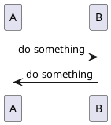
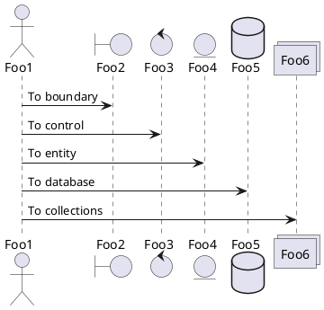
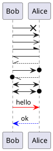
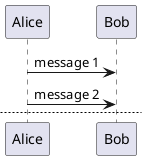
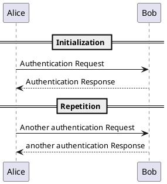
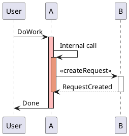
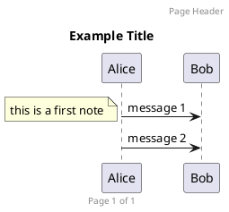

> 在写文档的过程中，经常需要进行画图。虽然说现在有很多类似viso之类的可视化画图工具，但是还是要花费大量时间在拖拉组件上，效率十分低下。最近在网上找到了一款还算不错的绘图工具-- Plantuml, 它本质上是也算一门可以快速画图的设计语言，学习起来也很方便。可以在http://plantuml.com/网站上体验一下。
>  在vscode, webstorm都有相关的插件可以使用。

# 时序图

时序图相对来说是平常比较经常画的一种设计图稿，在这里记录一下plantuml中相关的语法。

## 基本用法





image.png

## 设置不同的角色

时序图角色可以分为: actor, boundary, control, entity, database，每种角色呈现的图形也是不一样的。





image.png

## 不用的箭头样式





image.png

## 分页





image.png

## 分段





image.png

## 生命线





image.png

## 图例注脚等





image.png

# C4架构图

C4 model是一种软件架构图的设计方法，具体介绍可以参考[C4 architecture model](https://www.infoq.cn/article/C4-architecture-model)。利用[C4-PlantUML](https://github.com/RicardoNiepel/C4-PlantUML)工具，可以画出很多很不错的架构图。
 C4模型分为Context, Container, Component和Code 4个组成部分，我们一般在画图的时候主要用到前三个组成部分。


```puml
@startuml C4_Elements
!includeurl https://raw.githubusercontent.com/RicardoNiepel/C4-PlantUML/master/C4_Context.puml
!includeurl https://raw.githubusercontent.com/RicardoNiepel/C4-PlantUML/master/C4_Container.puml
!includeurl https://raw.githubusercontent.com/RicardoNiepel/C4-PlantUML/master/C4_Component.puml

System(systemAlias, "System", "这可以看作系统上下文(Context)")
Container(containerAlias, "Container", "这是Container")
Person(personAlias, "Person", "这可以看作是组件(Component)")

Rel(personAlias, containerAlias, "Label", "设置关联关系")
@enduml
```

